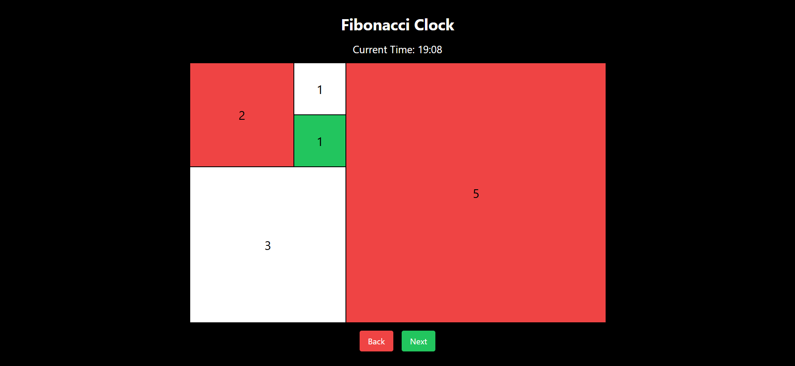

# Reservation Management Application

## Overview

A comprehensive reservation management application built with React, TypeScript, and Tailwind CSS. The app provides features to filter, sort, and search reservations, making it easy for users to manage and view their bookings.

## Features

- **Filter Reservations:** Filter by status, date range, shift, area, and search by customer name.
- **Sort Reservations:** Sort by guest number or customer name in ascending or descending order.
- **Search Functionality:** Search for reservations by customer first and last names.
- **Date Range Filtering:** Filter reservations by start and end dates.
- **Caching**: Caches filtered and sorted results for faster access.
- **Responsive Design**: Optimized for various screen sizes.

## Technologies Used

- **React:** JavaScript library for building user interfaces.
- **TypeScript:** A typed superset of JavaScript that compiles to plain JavaScript.
- **Tailwind CSS:** A utility-first CSS framework for creating custom designs.
- **Vite:** For fast bundling.
- **React Router:** For routing.
- **Other dependencies:**

## Getting Started

To get started with the Reservation Management app, follow these steps:

1. **Clone the Repository:**

   ```bash
   git clone <https://github.com/sohaibproject/restaurant_reservation.git>
   ```

2. **Navigate to the Project Directory:**

   ```bash
   cd restaurant_reservation

   ```

3. **Install Dependencies:**

   ```bash
   npm install

   ```

4. **Start the Development Server:**

   ```bash
   npm run dev

   ```

   ## Screenshots

   
